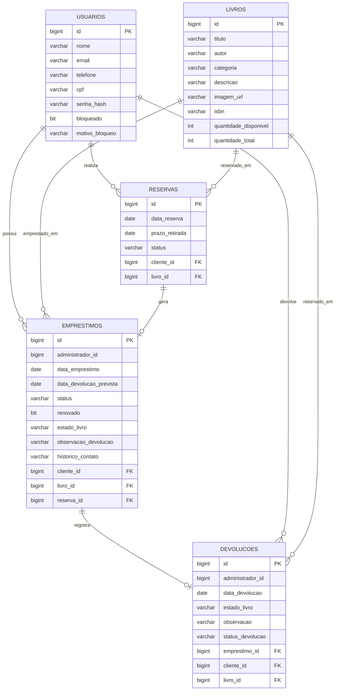

# MER e DER - TECHBOOK

Este documento resume a modelagem atual do banco do sistema TECHBOOK.

## MER

Entidades principais:

- Usuario: representa o cliente cadastrado na plataforma.
- Livro: representa os livros disponíveis no acervo.
- Reserva: representa a reserva feita pelo cliente para retirada presencial.
- Emprestimo: representa a retirada confirmada pelo administrador.
- Devolucao: representa a devolução registrada para um empréstimo.

Observação sobre administrador:

A documentação conceitual menciona a entidade Administrador. Na implementação atual, o administrador é validado por uma credencial fixa no backend e as operações administrativas guardam `administrador_id` como referência numérica. Por isso, não há uma tabela separada de administradores nesta versão.

## Regras De Relacionamento

- Um usuário pode ter várias reservas.
- Um usuário pode ter vários empréstimos, respeitando o limite de 3 livros em uso.
- Um livro pode aparecer em várias reservas ao longo do tempo.
- Um livro pode aparecer em vários empréstimos ao longo do tempo.
- Uma reserva pertence a um usuário e a um livro.
- Um empréstimo pertence a um usuário e a um livro.
- Um empréstimo pode estar ligado a uma reserva.
- Um empréstimo pode ter uma devolução registrada.
- Uma devolução pertence a um empréstimo, a um usuário e a um livro.

## DER Em Mermaid

